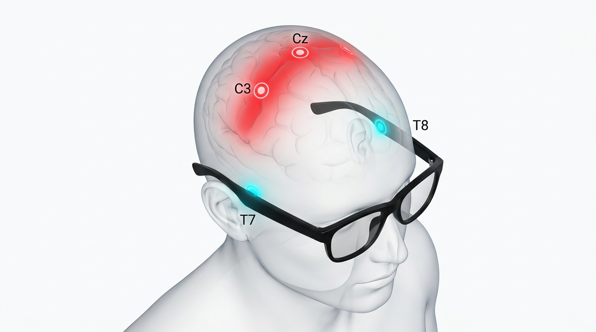
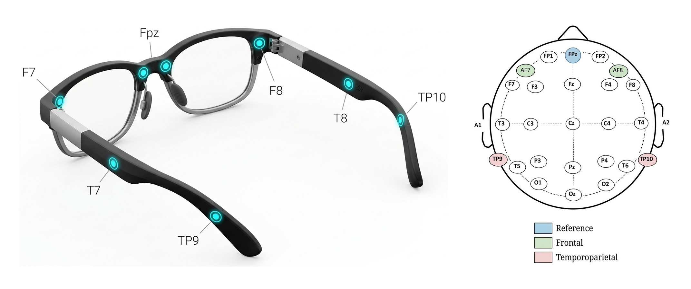

# Experimental Design: EEG Motor Imagery Classification for Smart Glasses Form Factor

**Project:** Can a machine learning model infer left/right motor imagery from EEG channels accessible by glasses frames, without direct access to the primary motor cortex?

**Author:** Kyubin Yun  
**Date:** August 28, 2026

---

## Table of Contents

1. [Research Motivation & Problem Statement](#1-research-motivation--problem-statement)
2. [Hypothesis & Research Questions](#2-hypothesis--research-questions)
3. [Neuroscientific Foundation](#3-neuroscientific-foundation)
4. [Dataset Selection](#4-dataset-selection)
5. [Preprocessing Pipeline](#5-preprocessing-pipeline)
6. [Model Architecture & Selection](#6-model-architecture--selection)
7. [Experimental Protocol](#7-experimental-protocol)
8. [Evaluation & Statistical Analysis Plan](#8-evaluation--statistical-analysis-plan)
9. [Risk Analysis & Mitigation](#9-risk-analysis--mitigation)
10. [Computational Environment](#10-computational-environment)
11. [References](#11-references)

---

## 1. Research Motivation & Problem Statement

### 1.1 The Consumer BCI Gap

Current Brain-Computer Interface (BCI) systems for motor imagery require research-grade EEG caps with electrodes placed directly over the primary motor cortex (C3, Cz, C4). These are impractical for everyday consumer use — they require conductive gel, head caps, and 20+ minutes of setup.

**Smart glasses** represent a compelling consumer form factor. However, the physical contact points of glasses frames (temples, nose bridge, behind ears) correspond to **lateral and frontal EEG positions** (T7/T8, F7/F8, Fp1/Fp2, TP9/TP10) — none of which directly overlie the sensorimotor cortex.



*Figure 1: Anatomical spatial separation between smart glasses contact sites (T7, T8) and the primary motor cortex (Cz, C3). The temple contacts (glowing cyan at T7 and T8) are physically separated from the upper scalp motor cortex (glowing red at Cz and C3) by more than 7 cm of skull and scalp tissue. Because smart glasses cannot physically contact the vertex or central sulcus, decoding motor imagery must rely exclusively on attenuated, far-field volume-conducted signals.*


### 1.2 Core Question

> If a well-trained model achieves high accuracy using full-channel EEG data including the motor cortex, can it maintain meaningful inferential performance when restricted to only the channels physically accessible by a glasses frame?

### 1.3 Project Scope

This is a **personal side project** to explore the feasibility of this idea using open-source EEG data. The scope is:

- **Phase 1:** Achieve robust baseline accuracy (target: >90% within-subject) using full-channel data with rigorous methodology.
- **Phase 2:** Systematically degrade channels and measure the accuracy drop when excluding motor cortex electrodes.
- **Phase 3:** Test classification using only "glasses-accessible" channels (T7, T8, F7, F8 + optionally Fp1, Fp2, TP9, TP10).

---

## 2. Hypothesis & Research Questions

### 2.1 Primary Hypothesis

**H₀ (Null):** A model trained on glasses-accessible EEG channels (T7, T8, F7, F8) cannot classify left vs. right hand motor imagery above chance level (50%) after removing primary motor cortex channels (C3, C4, Cz).

**H₁ (Alternative):** Volume-conducted sensorimotor rhythms, captured at lateral/temporal electrodes, retain sufficient inter-hemispheric asymmetry to support above-chance motor imagery classification.

### 2.2 Research Questions

| # | Research Question | Phase |
|:---:|:---|:---:|
| **RQ1** | What is the maximum achievable within-subject accuracy for binary (Left vs Right hand) motor imagery using full-channel data and rigorous methodology? | 1 |
| **RQ2** | How does classification accuracy degrade as a function of distance from the motor cortex — i.e., which channels contribute most to decoding? | 2 |
| **RQ3** | Is above-chance classification possible using only glasses-accessible channels (T7, T8, F7, F8)? If so, what is the accuracy ceiling? | 3 |
| **RQ4** | Does cross-hemisphere referencing (T7 vs T8 bipolar) preserve lateralized SMR gradients better than common average reference at peripheral sites? | 3 |
| **RQ5** | Can artifact confounds (EMG from temporalis muscle, EOG) inflate lateral-channel accuracy, and how can we control for this? | 3 |

### 2.3 Realistic Expectations (Based on Literature)

> [!WARNING]
> **Critical Context from Literature Review:**
> - **Full-channel within-subject accuracy** for 2-class MI (Left vs Right) typically ranges **78%–86%** on average across subjects, with top-performing subjects reaching **92%–98%**.
> - **>95% average across all subjects** is physiologically unrealistic due to the "BCI Illiteracy" phenomenon (15–30% of subjects produce weak or absent sensorimotor rhythms).
> - **Lateral-only channels (T7, T8, F7, F8) without C3/C4** are expected to degrade accuracy to **52%–62%** (near chance level) for genuine neural MI decoding.
> - Any study claiming >80% MI accuracy from purely frontal/temporal channels should be scrutinized for **EMG/EOG artifact confounds**.

**Revised Phase 1 Target:** Achieve **>85% within-subject accuracy** on high-performing subjects, and **>75% population average**, using full-channel data with methodologically sound preprocessing.

---

## 3. Neuroscientific Foundation

### 3.1 Sensorimotor Rhythms (SMR) and Motor Imagery

Motor imagery activates the primary motor cortex (M1, Brodmann Area 4) and supplementary motor area (SMA). This produces two key electrophysiological phenomena:

- **Event-Related Desynchronization (ERD):** Power decrease in mu (8–13 Hz) and beta (13–30 Hz) bands over the **contralateral** motor cortex during imagery.
- **Event-Related Synchronization (ERS):** Power increase (or maintenance) over the **ipsilateral** cortex — "surround inhibition."

$$\text{ERD/ERS\%} = \frac{P_{\text{active}} - P_{\text{baseline}}}{P_{\text{baseline}}} \times 100$$

| Imagery Task | Contralateral ERD | Ipsilateral ERS |
|:---|:---|:---|
| Right Hand | C3, FC3, CP3 (mu/beta ↓) | C4, FC4, CP4 (mu/beta ↑ or baseline) |
| Left Hand | C4, FC4, CP4 (mu/beta ↓) | C3, FC3, CP3 (mu/beta ↑ or baseline) |

### 3.2 Volume Conduction and Lateral Detection

The skull acts as a spatial low-pass filter with conductivity ratio $\sigma_{\text{brain}} / \sigma_{\text{skull}} \approx 15:1$ to $80:1$. Signals from C3/C4 are attenuated at lateral sites:

- **Amplitude attenuation at T7/T8:** 70%–90% reduction (3×–10× amplitude drop)
- **Power attenuation:** 90%–99% ($-10$ dB to $-20$ dB)

```
            [Primary Motor Cortex Hand Knob (C3 Dipole)]
                                 |
                                 ▼
   [CSF]   σ = 1.79 S/m      → High conductor: Lateral current spreading along surface
                                 |
                                 ▼
   [Skull] σ = 0.01–0.03 S/m → Extreme insulator: Severe spatial low-pass filter
                                 |
                                 ▼
   [Scalp] σ = 0.33 S/m      → Moderate conductor: Final tangential dispersion
                  ┌──────────────┴──────────────┐
                  ▼                             ▼
        C3 Electrode (Overhead)        T7 Electrode (~7 cm Lateral)
        • 100% Baseline SNR            • 70%–90% Amplitude reduction (10%–30% residual)
                                       • 90%–99% Power attenuation (-10 dB to -20 dB)
                                       • Direct temporalis muscle EMG contamination
```

### 3.3 Electrode Positions and Glasses Mapping



*Figure 2: Smart glasses form factor electrode mapping and 10-20 scalp projections. (Left) Physical contact sites along the smart glasses frame, including nose bridge pads (Fpz), front frame hinges (F7 / F8), temple arms (T7 / T8), and behind-ear temple tips (TP9 / TP10). (Right) Corresponding 2D 10-20 montage topomap highlighting reference (blue), frontal (green), and temporoparietal (pink) electrode positions.*

| Glasses Contact Point | 10-20 Position | Underlying Cortex | Relevance to MI |
|:---|:---|:---|:---|
| Temple arms | T7 / T8 | Middle Temporal Gyrus (BA 21/22) | Auditory cortex; far-field volume-conducted SMR |
| Frame hinges | F7 / F8 | Inferior Frontal Gyrus (BA 45/47) | Broca's area; no direct motor representation |
| Nose bridge | Fpz / Fp1 / Fp2 | Frontal Pole (BA 10) | Executive control; EOG artifacts |
| Behind ears | TP9 / TP10 | Mastoid / Retroauricular | Reference site; far-field alpha/SMR |

---

## 4. Dataset Selection

### 4.1 Selection Criteria

For this experiment, the dataset **must** satisfy:

1. Binary left/right hand motor imagery task
2. Contains channels C3, C4, Cz (for Phase 1 baseline)
3. Contains channels T7/T3, T8/T4, F7, F8 (for Phase 3 glasses simulation)
4. Sufficient trial count per subject (≥100 trials for reliable within-subject evaluation)
5. Available via Python (MNE / MOABB / braindecode)

### 4.2 Dataset Comparison

| Dataset | Subjects | Channels | Has T7/T8, F7/F8? | Trials (L/R MI) | Fs (Hz) | Verdict |
|:---|:---:|:---:|:---:|:---:|:---:|:---|
| **PhysioNet EEGMMI** | 109 (103 clean) | 64 | Yes | ~42–45 / subj | 160 | Low trial count |
| **BCI Comp. IV 2a** | 9 | 22 | No | 288 / subj | 250 | Missing lateral channels |
| **Lee2019_MI** | 54 | 62 | Yes | 400 / subj | 1000 | **Primary choice** |
| **Cho2017** | 52 | 64 | Yes | 100–120 / subj | 512 | **Secondary choice** |
| **Schirrmeister2017 (HGD)** | 14 | 128 | Yes | ~500 L/R / subj | 500 | **DL validation** |
| **BCI Comp. IV 2b** | 9 | 3 | No | 720 / subj | 250 | Only C3/Cz/C4 |

### 4.3 Selected Datasets

#### Primary Dataset: Lee2019_MI

**Rationale:** Largest modern Left/Right MI dataset with 54 subjects, 400 trials per subject, multi-session design, full 62-channel coverage including all target channels. Ideal for both within-subject and cross-subject evaluation.

```python
from moabb.datasets import Lee2019_MI
from moabb.paradigms import LeftRightImagery

dataset = Lee2019_MI()
paradigm = LeftRightImagery()
X, y, metadata = paradigm.get_data(dataset=dataset, subjects=list(range(1, 55)))
```

#### Secondary Dataset: Cho2017

**Rationale:** 52 subjects with 64-channel coverage, includes EMG verification channels to confirm no actual muscle activation during imagery — critical for artifact control in Phase 3.

```python
from moabb.datasets import Cho2017
dataset = Cho2017()
```

#### Validation Dataset: Schirrmeister2017 (High-Gamma Dataset)

**Rationale:** 128 channels at 500 Hz with ~1000 trials per subject. Best available dataset for training deep learning models without overfitting. Used to validate findings from Lee2019.

```python
from moabb.datasets import Schirrmeister2017
dataset = Schirrmeister2017()
```

---

## 5. Preprocessing Pipeline

### 5.1 Pipeline Overview

```
Raw EEG (Continuous)
    │
    ├─ [1] Load & Channel Selection [Jasper, 1958]
    │       Select target montage subset or use full channels (International 10-20 standard)
    │
    ├─ [2] Band-Pass Filter (Continuous) [Widmann et al., 2015]
    │       ★ MUST filter before epoching to avoid edge ringing
    │       IIR Butterworth 4th order, zero-phase (filtfilt)
    │       Passband: 4–40 Hz (DL: Schirrmeister et al., 2017) or 8–30 Hz (CSP/Riemannian: Lemm et al., 2011)
    │
    ├─ [3] Notch Filter [Widmann et al., 2015]
    │       50 Hz (Korea/Europe) or 60 Hz (US), Q ≥ 30
    │
    ├─ [4] Bad Channel Detection & Interpolation [Perrin et al., 1989]
    │       Detect flat/noisy channels → spherical spline interpolation
    │       ★ MUST do before CAR to prevent noise injection
    │
    ├─ [5] Re-Referencing [McFarland et al., 1997]
    │       Common Average Reference (CAR) for ≥32 channels
    │       Or Surface Laplacian (CSD) for high spatial specificity
    │       ★ Never use Cz as reference for MI (extinguishes foot MI, distorts C3/C4)
    │
    ├─ [6] ICA Artifact Removal [Ablin et al., 2018; Winkler et al., 2015]
    │       Algorithm: Picard (preconditioned fast ICA) or Extended Infomax
    │       High-pass ≥1.0 Hz before ICA fitting (Winkler et al., 2015)
    │       Identify EOG components (correlation with Fp1/Fp2 > 0.4)
    │       ★ Fit ICA on training data only (no data leakage)
    │
    ├─ [7] Epoching [Schirrmeister et al., 2017]
    │       Window: [0.5s, 4.0s] post-cue (avoid cue-evoked VEP in first 0.5s)
    │       Baseline: [-1.0s, 0.0s] relative to cue onset
    │
    ├─ [8] Artifact Rejection [Jas et al., 2017]
    │       Peak-to-peak threshold: 80–120 µV (sensorimotor channels)
    │       Or use autoreject for automated Bayesian thresholding
    │
    ├─ [9] Normalization [Schirrmeister et al., 2017; Varoquaux et al., 2017]
    │       Per-channel z-score (fit on training set only)
    │       Or Exponential Moving Standardization (EMS for Braindecode)
    │
    └─ [10] Feature Extraction / Model Input [Lawhern et al., 2018; Lemm et al., 2011]
            CSP: Covariance matrix → spatial filters → log-variance
            DL: Raw normalized epochs (1, C, T) tensor (resampled to 128/250 Hz)
```

#### 5.1.1 Academic Foundations and Protocol Standards by Stage

Each stage of the preprocessing workflow is derived from peer-reviewed signal processing principles and BCI benchmark standards:

1. **Montage Specification & Channel Selection (`[1]`):**
   - *Reference:* **Jasper (1958)**, *Electroencephalography and Clinical Neurophysiology*.
   - *Methodological Basis:* Anatomical alignment conforms strictly to the International 10-20 electrode placement standard. Reproducible channel selection ensures geographic correspondence across subjects and allows precise spatial sub-sampling into progressive degradation tiers (T0–T6).
2. **Continuous Band-Pass Filtering & Edge Ringing Prevention (`[2]`):**
   - *References:* **Widmann et al. (2015)**, *Journal of Neuroscience Methods*; **Lemm et al. (2011)**, *NeuroImage*; **Schirrmeister et al. (2017)**, *Human Brain Mapping*.
   - *Methodological Basis:* Filtering discrete, segmented epochs introduces severe non-causal boundary discontinuities and "edge ringing" artifacts into the trial window. Filtering must be performed continuously prior to epoching using a zero-phase forward-backward Butterworth filter (`filtfilt`, 4th order, $-24\text{ dB/octave}$) or linear-phase FIR filter. Passbands are tailored to the decoding architecture: 8–30 Hz isolates canonical sensorimotor mu and beta rhythms for CSP/Riemannian classifiers, while 4–40 Hz provides broadband temporal features for deep convolutional neural networks.
3. **Notch Line-Noise Suppression (`[3]`):**
   - *Reference:* **Widmann et al. (2015)**, *Journal of Neuroscience Methods*.
   - *Methodological Basis:* Mains interference (50 Hz in Korea/Europe, 60 Hz in the US) introduces sharp narrow-band noise that can bias covariance estimators. A notch filter with quality factor $Q \ge 30$ eliminates line noise harmonics while preserving sensorimotor spectral density within adjacent frequency bins.
4. **Bad Channel Detection & Spherical Spline Interpolation (`[4]`):**
   - *Reference:* **Perrin et al. (1989)**, *Electroencephalography and Clinical Neurophysiology*.
   - *Methodological Basis:* Non-functional, bridged, or excessively noisy electrodes inject variance into every clean channel if included in spatial averages. Damaged channels are identified via correlation thresholds ($r < 0.4$) and variance outliers, then reconstructed via 3D spherical spline interpolation using Legendre polynomials, ensuring smooth spatial scalp potential recovery before montage transformations.
5. **Spatial Re-Referencing & Vertex (Cz) Bias Avoidance (`[5]`):**
   - *Reference:* **McFarland et al. (1997)**, *Electroencephalography and Clinical Neurophysiology*.
   - *Methodological Basis:* Ear/mastoid unipolar referencing often picks up temporal muscle noise. Common Average Reference (CAR) or Current Source Density (CSD / Surface Laplacian) acts as a spatial high-pass filter that accentuates local cortical generators over widespread volume conduction. Furthermore, referencing to the vertex ($C_z$) must be strictly avoided during motor imagery: $C_z$ directly overlies the homuncular foot motor area, extinguishing foot MI rhythms and distorting the contralateral dipole field between $C_3$ and $C_4$.
6. **Independent Component Analysis (ICA) & Preconditioning (`[6]`):**
   - *References:* **Winkler et al. (2015)**, *IEEE EMBC*; **Ablin et al. (2018)**, *IEEE TSP*.
   - *Methodological Basis:* High-pass filtering at $\ge 1.0\text{ Hz}$ is mandatory prior to ICA decomposition because slow baseline drifts degrade component separation and convergence stability (Winkler et al., 2015). The Picard algorithm (Ablin et al., 2018) utilizes preconditioned L-BFGS approximations to converge orders of magnitude faster than standard Infomax while maintaining mathematical equivalence. ICA unmixing matrices are fitted strictly on training folds to prevent test artifact pattern leakage.
7. **Post-Cue Epoching & Visual Evoked Potential (VEP) Exclusion (`[7]`):**
   - *Reference:* **Schirrmeister et al. (2017)**, *Human Brain Mapping*.
   - *Methodological Basis:* Visual cue presentation triggers an obligatory visual evoked potential (VEP) in the primary visual and parietal cortices during the first 0–500 ms post-cue. Truncating the analysis window to $[0.5\text{s}, 4.0\text{s}]$ post-cue eliminates visual stimulus confounds and isolates pure, endogenous sensorimotor rhythm (ERD/ERS) dynamics.
8. **Automated Bayesian Artifact Rejection (`[8]`):**
   - *Reference:* **Jas et al. (2017)**, *NeuroImage*.
   - *Methodological Basis:* Arbitrary global amplitude thresholds (e.g., $100\ \mu\text{V}$) lead to either over-rejection of physiological transients or retention of localized channel bursts. The `autoreject` algorithm optimizes channel- and trial-specific thresholds through cross-validated Bayesian optimization, objectively pruning artifacts without manual analyst bias.
9. **Leakage-Free Normalization & Exponential Moving Standardization (`[9]`):**
   - *References:* **Schirrmeister et al. (2017)**, *Human Brain Mapping*; **Varoquaux et al. (2017)**, *NeuroImage*; **Varoquaux (2018)**, *NeuroImage*.
   - *Methodological Basis:* Computing dataset-wide mean and standard deviation leaks test distribution statistics into model training. For traditional architectures, z-score parameters are fitted strictly inside training folds. For deep neural networks, Exponential Moving Standardization (EMS) computes causal, exponentially weighted running mean and variance to handle temporal non-stationarity across recording blocks.
10. **Feature Dimension & Temporal Resampling (`[10]`):**
    - *References:* **Lawhern et al. (2018)**, *Journal of Neural Engineering*; **Lemm et al. (2011)**, *NeuroImage*.
    - *Methodological Basis:* Downsampling from original sampling rates (e.g., 500 Hz or 1000 Hz) to 128 Hz or 250 Hz preserves full fidelity for the Nyquist band (up to 64 Hz or 125 Hz, fully encompassing the 4–40 Hz SMR passband) while cutting convolution filter lengths, memory footprint, and gradient propagation steps by up to $75\%$.

### 5.2 Critical Anti-Patterns to Avoid

| # | Anti-Pattern | Consequence | Correct Approach | Key Reference(s) |
|:---:|:---|:---|:---|:---|
| 1 | **Filtering after epoching** | Edge ringing artifacts and boundary discontinuity distortion | Filter continuous raw data first, then segment into epochs | Widmann et al. (2015) |
| 2 | **Fitting CSP on full dataset** | Data leakage across folds → artificially inflated classification accuracy | Fit spatial filters strictly within training fold of each CV split | Lemm et al. (2011); Varoquaux et al. (2017); Varoquaux (2018) |
| 3 | **Computing global z-score before split** | Leaks test distribution statistics (mean/variance) into training | Fit standardizers on training set only; apply transforms to test set | Lemm et al. (2011); Varoquaux et al. (2017); Varoquaux (2018) |
| 4 | **Overlapping sliding windows split randomly** | Severe temporal autocorrelation leakage between adjacent slices | Split data at trial or recording session level first, then window | Lemm et al. (2011); Schirrmeister et al. (2017) |
| 5 | **ICA fitted on train + test combined** | Distribution leakage of test artifact topologies into training models | Fit ICA unmixing matrices per-subject strictly on training data | Winkler et al. (2015); Varoquaux et al. (2017); Varoquaux (2018) |
| 6 | **Using Cz as reference for MI** | Extinguishes foot MI signal, distorts contralateral C3/C4 dipole gradients | Re-reference to Common Average Reference (CAR) or Surface Laplacian | McFarland et al. (1997) |
| 7 | **CAR with bad channels included** | High-amplitude sensor artifacts and drift injected into all clean channels | Detect and interpolate bad channels with spherical splines prior to CAR | Perrin et al. (1989); MNE-Python Guidelines (Gramfort et al., 2013); Clinical EEG Guidelines |

### 5.3 Preprocessing Parameters Summary

| Parameter | CSP/Riemannian Pipeline | Deep Learning Pipeline | Key Rationale & Primary Reference(s) |
|:---|:---|:---|:---|
| **Band-pass** | 8–30 Hz | 4–40 Hz | Classical SMR (mu/beta) isolation vs. broadband spectral feature learning in CNNs (Lemm et al., 2011; Schirrmeister et al., 2017) |
| **Filter type** | Butterworth 4th order, zero-phase | FIR or Butterworth, zero-phase | Zero phase distortion (`filtfilt`), maximally flat passband response (Widmann et al., 2015) |
| **Notch filter** | 50 Hz (EU/Asia) / 60 Hz (US), $Q \ge 30$ | 50 Hz (EU/Asia) / 60 Hz (US), $Q \ge 30$ | Suppresses electrical mains interference without distorting adjacent sensorimotor oscillations (Widmann et al., 2015) |
| **Re-reference** | CAR | CAR | Spatial zero-sum reference preserving bilateral motor gradients without Cz electrode bias (McFarland et al., 1997) |
| **Epoch window** | [0.5s, 3.5s] post-cue | [0.5s, 4.0s] post-cue | Discards initial 500 ms cue-onset VEP; isolates sustained motor imagery dynamics (Schirrmeister et al., 2017) |
| **Baseline** | [-1.0s, 0.0s] subtractive | [-1.0s, 0.0s] subtractive | Pre-cue resting state baseline correction (Pfurtscheller & Lopes da Silva, 1999) |
| **Artifact threshold** | 100 µV peak-to-peak | autoreject | Clinical fixed amplitude thresholding vs. cross-validated Bayesian learned sensor rejection (Jas et al., 2017) |
| **Normalization** | None (CSP handles internally) | Per-channel z-score or EMS | Covariance normalization vs. Exponential Moving Standardization for non-stationary signals (Schirrmeister et al., 2017; Varoquaux et al., 2017) |
| **Resample** | 250 Hz | 128 Hz (EEGNet) or 250 Hz | Nyquist coverage for 40 Hz passband while minimizing parameter count and training latency (Lawhern et al., 2018) |

---

## 6. Model Architecture & Selection

### 6.1 Model Comparison Matrix

| Model | Type | Parameters | BCI IV-2a 2-Class Acc | PhysioNet 2-Class Acc | Best For |
|:---|:---|:---:|:---:|:---:|:---|
| **CSP + LDA** | Traditional | ~12 weights | 79%–83% | 76%–82% | Baseline reference |
| **FBCSP** | Traditional | Variable | 82%–86% | 80%–85% | Robust traditional baseline |
| **Riemannian TS + LR** | Traditional | $C(C+1)/2$ | 84%–89% | 83%–88% | Best classical; small datasets |
| **EEGNet-8,2** | CNN | ~2.5k | 80%–84% | 81%–86% | Low-param DL baseline |
| **ShallowConvNet** | CNN | ~45k | 82%–87% | 82%–87% | SMR-optimized DL |
| **EEG Conformer** | Hybrid CNN+Transformer | ~1M–2M | 86%–91% | 86%–91% | Max performance (large data) |

### 6.2 Selected Models for Each Phase

#### Phase 1 (Full-Channel Baseline)

All five models will be evaluated to establish comprehensive baselines:

1. **CSP + LDA** — Gold standard traditional baseline
2. **Riemannian Tangent Space + Logistic Regression** — State-of-the-art traditional
3. **EEGNet-8,2** — Compact deep learning baseline
4. **ShallowConvNet** — SMR-optimized deep learning
5. **EEG Conformer** — Maximum capacity model (if dataset size permits)

```python
# Classical Pipelines
from pyriemann.estimation import Covariances
from pyriemann.tangentspace import TangentSpace
from sklearn.pipeline import make_pipeline
from sklearn.linear_model import LogisticRegression
from sklearn.discriminant_analysis import LinearDiscriminantAnalysis
from mne.decoding import CSP

# Pipeline 1: CSP + LDA
pipe_csp = make_pipeline(
    CSP(n_components=6, log=True, norm_trace=False),
    LinearDiscriminantAnalysis()
)

# Pipeline 2: Riemannian TS + Logistic Regression
pipe_riemann = make_pipeline(
    Covariances(estimator='lwf'),
    TangentSpace(metric='riemann'),
    LogisticRegression(penalty='l2', C=1.0, solver='lbfgs', max_iter=1000)
)
```

#### Phase 2 (Channel Degradation)

Use the **best-performing model from Phase 1** and systematically reduce channels.

#### Phase 3 (Glasses-Only)

Re-train all models from Phase 1 using only the glasses-accessible channel subset.

### 6.3 Deep Learning Hyperparameters

| Hyperparameter | EEGNet-8,2 | ShallowConvNet | EEG Conformer |
|:---|:---|:---|:---|
| **Temporal kernel** | $f_s / 2$ (64 @ 128 Hz) | $(1, 25)$ | $(1, 31)$ |
| **Spatial filters** | $F_1=8$, $D=2$, $F_2=16$ | 40 | 40 |
| **Dropout** | 0.25–0.5 | 0.5 | 0.3–0.5 |
| **Optimizer** | Adam | Adam | AdamW |
| **Learning rate** | $1 \times 10^{-3}$ | $6.25 \times 10^{-4}$ | $5 \times 10^{-4}$ |
| **Weight decay** | $1 \times 10^{-4}$ | 0 | $5 \times 10^{-2}$ |
| **Epochs** | 300–500 | 500 | 500 |
| **Batch size** | 64 | 64 | 32–64 |
| **Early stopping** | Patience 50 | Patience 50 | Patience 30 |

### 6.4 Data Augmentation Strategy (Deep Learning)

| Technique | Parameters | Apply When |
|:---|:---|:---|
| **Sliding window** | Window: 2.5s, Stride: 0.25s | After trial-level train/test split |
| **Gaussian noise** | σ = 0.02 × std(X) | Training only |
| **Channel dropout** | $p_{\text{drop}} = 0.1$ | Training only |
| **EEG Mixup** | $\lambda \sim \text{Beta}(0.3, 0.3)$ | Training only, same class |

---

## 7. Experimental Protocol

### 7.1 Phase 1 — Full-Channel Baseline

**Objective:** Establish robust, methodologically sound baseline accuracies using all available EEG channels.

#### Channel Configuration
- **Full montage:** All 62 channels (Lee2019_MI) or all 64 channels (Cho2017)

#### Cross-Validation Strategy
- **Within-subject:** 5-fold stratified cross-validation (preserving class balance)
- **Cross-session:** Train on Session 1, test on Session 2 (Lee2019 only)
- **Cross-subject (LOSO):** Leave-One-Subject-Out for generalization assessment

#### Metrics
- Classification Accuracy (%)
- Cohen's Kappa ($\kappa$)
- Confusion Matrix
- Per-subject accuracy distribution (histogram + box plot)

#### Success Criteria
- Population average accuracy **≥75%** across all subjects
- Top-quartile subjects **≥85%**
- Identification of "BCI-literate" vs "BCI-illiterate" subjects for Phase 2/3 analysis

---

### 7.2 Phase 2 — Systematic Channel Degradation

**Objective:** Map the relationship between electrode proximity to motor cortex and classification accuracy.

#### Channel Degradation Tiers

| Tier | Channels Included | # Channels | Rationale |
|:---:|:---|:---:|:---|
| **T0** | Full montage (all 62) | 62 | Phase 1 baseline |
| **T1** | Sensorimotor core: C3, C1, Cz, C2, C4, FC3, FC1, FCz, FC2, FC4, CP3, CP1, CPz, CP2, CP4 | 15 | Motor cortex + immediate surround |
| **T2** | Central strip only: C3, Cz, C4, FC3, FC4, CP3, CP4 | 7 | Minimal motor cortex coverage |
| **T3** | Minimal central: C3, Cz, C4 | 3 | BCI Competition IV 2b equivalent |
| **T4** | Central + Lateral: C3, Cz, C4, T7, T8, F7, F8 | 7 | Hybrid: motor cortex + glasses |
| **T5** | Lateral only (glasses): T7, T8, F7, F8 | 4 | Glasses frame simulation — **KEY TEST** |
| **T6** | Extended glasses: T7, T8, F7, F8, Fp1, Fp2, TP9, TP10 | 8 | Glasses + nose bridge + behind ears |

#### Protocol
1. For each tier, **re-train** all Phase 1 models using only the specified channel subset.
2. CSP filters and Riemannian covariances are recomputed for each channel configuration.
3. Plot **Degradation Curve:** Accuracy (y-axis) vs. Channel Tier (x-axis).

#### Key Comparisons
- **T0 → T3:** How much accuracy is retained with just 3 central channels?
- **T3 → T5:** The critical gap — what is lost when motor cortex channels are completely removed?
- **T4 vs T5:** Does adding C3/C4 to the glasses channels significantly improve accuracy?
- **T5 vs T6:** Does adding nose bridge (Fp1/Fp2) and behind-ear (TP9/TP10) channels help?

---

### 7.3 Phase 3 — Glasses-Only Classification & Artifact Control

**Objective:** Rigorously evaluate whether genuine neural MI can be decoded from glasses-accessible channels, controlling for artifact confounds.

#### 3A. Classification with Glasses Channels

Channel set: **T7, T8, F7, F8** (Tier T5) and extended **T7, T8, F7, F8, Fp1, Fp2, TP9, TP10** (Tier T6).

#### 3B. Re-referencing Experiment

Test different referencing strategies optimized for lateral montages:

| Strategy | Formulation | Hypothesis |
|:---|:---|:---|
| CAR (4-ch) | $v_i - \frac{1}{4}\sum v_k$ | Likely ineffective — too few channels for CAR |
| Cross-hemisphere bipolar | $T7 - T8$ and $F7 - F8$ | May preserve lateralized SMR asymmetry |
| Linked mastoids | $v_i - \frac{A1 + A2}{2}$ | Standard sparse-montage reference |
| Ipsilateral bipolar | $T7 - F7$ (left) and $T8 - F8$ (right) | Tests local gradient |

#### 3C. Artifact Control Protocol

> [!CAUTION]
> **This is the most critical section of the entire experiment.**
> Temporal channels (T7/T8) sit directly on the temporalis muscle. Any MI decoding accuracy above chance from these channels could be driven by **subconscious jaw clenching or muscle tension** rather than genuine neural activity.

**Artifact Control Measures:**

1. **EMG Frequency Analysis:**
   - Compare classification accuracy using **8–13 Hz only** (pure mu-rhythm, below EMG range) vs. **20–45 Hz** (EMG-contaminated range).
   - If accuracy is driven by the 20–45 Hz band at lateral channels, it is likely EMG-based.

2. **EMG Amplitude Monitoring (Cho2017 only):**
   - Use the simultaneous forearm EMG channels to verify no actual motor execution.
   - Correlate temporal-channel high-gamma power with EMG amplitude.

3. **ICA Component Inspection:**
   - After ICA decomposition, classify components as neural vs. myogenic.
   - Re-run classification with and without muscle-artifact ICA components to measure artifact contribution.

4. **Permutation Testing:**
   - For any lateral-channel accuracy >55%, run 1000 permutation tests (shuffled labels) to establish the null distribution and compute the exact p-value.

5. **Topographic Validation:**
   - Visualize CSP spatial filter topomaps. Genuine MI patterns should show clear contralateral lateralization centered on C3/C4. If topomaps show temporal/frontal maxima, the signal is likely artifactual.

---

## 8. Evaluation & Statistical Analysis Plan

### 8.1 Metrics

| Metric | Formula | Purpose |
|:---|:---|:---|
| **Accuracy** | $\frac{TP + TN}{TP + TN + FP + FN}$ | Primary performance measure |
| **Cohen's Kappa (κ)** | $\kappa = \frac{p_o - p_e}{1 - p_e}$ | Chance-adjusted agreement (critical for 2-class MI) |
| **AUC-ROC** | Area under ROC curve | Threshold-independent discrimination |
| **Per-subject accuracy** | Individual subject scores | Identify BCI-literate subgroup |

### 8.2 Statistical Tests

| Comparison | Test | Rationale |
|:---|:---|:---|
| Model A vs Model B (same subjects) | **Paired Wilcoxon signed-rank test** | Non-parametric, paired comparison of accuracy distributions |
| Channel Tier X vs chance (50%) | **One-sample Wilcoxon** + **Permutation test (n=1000)** | Conservative non-parametric test against chance |
| Accuracy across channel tiers | **Friedman test** (repeated measures) | Non-parametric ANOVA for multiple related groups |
| Post-hoc pairwise tier comparisons | **Nemenyi test** or **Wilcoxon with Bonferroni correction** | Multiple comparison correction |

### 8.3 Reporting Standards

- Report **mean ± std** accuracy across subjects
- Report **median** and **IQR** (interquartile range) to account for BCI-illiterate outliers
- Provide **per-subject accuracy table** (no cherry-picking)
- Include **box plots** showing full distribution for each channel tier
- Report **exact p-values** for all statistical comparisons
- Use **α = 0.05** (Bonferroni-corrected for multiple comparisons)

---

## 9. Risk Analysis & Mitigation

### 9.1 Technical Risks

| Risk | Likelihood | Impact | Mitigation |
|:---|:---:|:---:|:---|
| Phase 1 accuracy below 75% average | Medium | High | Try multiple preprocessing pipelines; use subject screening; consider adding motor execution trials |
| Phase 3 accuracy at chance level | **High** | Medium | This is a valid negative result. Document rigorously with artifact controls to confirm it is genuine. |
| EMG artifacts inflating lateral accuracy | **High** | **Critical** | Implement full artifact control protocol (Section 7.3C) |
| Data leakage inflating all results | Medium | Critical | Use sklearn Pipeline; fit all transforms inside CV folds; verify with MOABB benchmark |
| Overfitting DL models on small trial counts | Medium | High | Use EEGNet (2.5k params); early stopping; data augmentation; report training curves |
| Computational resource constraints | Low | Medium | Start with CSP/Riemannian (fast); use EEGNet before Conformer |

### 9.2 Methodological Risks

| Risk | Mitigation |
|:---|:---|
| Confirmation bias (wanting lateral channels to work) | Pre-register hypothesis; implement rigorous artifact controls; report negative results honestly |
| Comparing different preprocessing for different tiers | Use **identical** preprocessing pipeline for all channel tiers |
| Session/order effects in cross-session evaluation | Randomize session assignment; report both directions |

---

## 10. Computational Environment

```
# requirements.txt
mne>=1.7.0
moabb>=1.1.0
braindecode>=0.8.0
pyriemann>=0.5
scikit-learn>=1.5.0
torch>=2.3.0
numpy>=1.26.0
pandas>=2.2.0
matplotlib>=3.9.0
seaborn>=0.13.0
autoreject>=0.4.0
scipy>=1.14.0
```

---

## 11. References

### Datasets
- Lee, M.-H., Kwon, O.-Y., Kim, Y.-J., Kim, H.-K., Lee, Y.-E., Williamson, J., Fazli, S., & Lee, S.-W. (2019). EEG dataset and OpenBMI toolbox for three BCI paradigms: An investigation into BCI illiteracy. *GigaScience*, 8(5), giz002. [doi:10.1093/gigascience/giz002](https://doi.org/10.1093/gigascience/giz002)
- Cho, H., Ahn, M., Ahn, S., Kwon, M., & Jun, S. C. (2017). EEG datasets for motor imagery brain–computer interface. *GigaScience*, 6(7), gix034. [doi:10.1093/gigascience/gix034](https://doi.org/10.1093/gigascience/gix034)
- Schirrmeister, R. T., Springenberg, J. T., Fiederer, L. D. J., Glasstetter, M., Eggensperger, K., Tangermann, M., Hutter, F., Burgard, W., & Ball, T. (2017). Deep learning with convolutional neural networks for EEG decoding and visualization. *Human Brain Mapping*, 38(11), 5391–5420. [doi:10.1002/hbm.23730](https://doi.org/10.1002/hbm.23730)
- Goldberger, A. L., Amaral, L. A., Glass, L., Hausdorff, J. M., Ivanov, P. C., Mark, R. G., Mietus, J. E., Moody, G. B., Peng, C. K., & Stanley, H. E. (2000). PhysioBank, PhysioToolkit, and PhysioNet: Components of a new research resource for complex physiologic signals. *Circulation*, 101(23), e215–e220. [doi:10.1161/01.cir.101.23.e215](https://doi.org/10.1161/01.cir.101.23.e215)
- Brunner, C., Leeb, R., Müller-Putz, G., Schlögl, A., & Pfurtscheller, G. (2008). BCI Competition 2008 – Graz data set A. *Institute for Knowledge Discovery*, Graz University of Technology, 16.

### Signal Processing, Preprocessing & Validation
- Ablin, P., Cardoso, J. F., & Gramfort, A. (2018). Faster independent component analysis by preconditioning with Hessian approximations. *IEEE Transactions on Signal Processing*, 66(15), 4040–4049. [doi:10.1109/TSP.2018.2844203](https://doi.org/10.1109/TSP.2018.2844203)
- Gramfort, A., Luessi, M., Larson, E., Engemann, D. A., Strohmeier, D., Brodbeck, C., Goj, R., Jas, M., Brooks, T., Parkkonen, L., & Hämäläinen, M. (2013). MEG and EEG data analysis with MNE-Python. *Frontiers in Neuroscience*, 7, 267. [doi:10.3389/fnins.2013.00267](https://doi.org/10.3389/fnins.2013.00267)
- Jas, M., Larson, E., Engemann, D. A., Leppäkangas, J., Taulu, S., Hämäläinen, M., & Gramfort, A. (2017). Autoreject: Automated artifact rejection for MEG and EEG data. *NeuroImage*, 159, 417–429. [doi:10.1016/j.neuroimage.2017.06.030](https://doi.org/10.1016/j.neuroimage.2017.06.030)
- Jasper, H. H. (1958). The ten-twenty electrode system of the International Federation. *Electroencephalography and Clinical Neurophysiology*, 10, 371–375. [doi:10.1016/0013-4694(58)90053-1](https://doi.org/10.1016/0013-4694(58)90053-1)
- Lemm, S., Blankertz, B., Dickhaus, T., & Müller, K. R. (2011). Introduction to machine learning for brain imaging. *NeuroImage*, 56(2), 387–399. [doi:10.1016/j.neuroimage.2010.11.004](https://doi.org/10.1016/j.neuroimage.2010.11.004)
- McFarland, D. J., McCane, L. M., David, S. V., & Wolpaw, J. R. (1997). Spatial filter selection for EEG-based communication. *Electroencephalography and Clinical Neurophysiology*, 103(3), 386–394. [doi:10.1016/S0013-4694(97)00022-2](https://doi.org/10.1016/S0013-4694(97)00022-2)
- Perrin, F., Pernier, J., Bertrand, O., & Echallier, J. F. (1989). Spherical splines for scalp potential and current density mapping. *Electroencephalography and Clinical Neurophysiology*, 72(2), 184–187. [doi:10.1016/0013-4694(89)90180-6](https://doi.org/10.1016/0013-4694(89)90180-6)
- Varoquaux, G., Raamana, P. R., Engemann, D. A., Hoyos-Idrobo, A., Schwartz, Y., & Thirion, B. (2017). Assessing and tuning brain decoders: Cross-validation, caveats, and guidelines. *NeuroImage*, 145, 166–179. [doi:10.1016/j.neuroimage.2016.10.038](https://doi.org/10.1016/j.neuroimage.2016.10.038)
- Varoquaux, G. (2018). Cross-validation failure: Small sample sizes lead to large error bars. *NeuroImage*, 180, 68–77. [doi:10.1016/j.neuroimage.2017.06.061](https://doi.org/10.1016/j.neuroimage.2017.06.061)
- Widmann, A., Schröger, E., & Maess, B. (2015). Digital filter design for electrophysiological data – a practical approach. *Journal of Neuroscience Methods*, 250, 34–46. [doi:10.1016/j.jneumeth.2014.09.005](https://doi.org/10.1016/j.jneumeth.2014.09.005)
- Winkler, I., Debener, S., Müller, K. R., & Tangermann, M. (2015). On the influence of high-pass filtering on ICA-based artifact reduction in EEG-ERP. *37th Annual International Conference of the IEEE EMBC*, 4101–4105. [doi:10.1109/EMBC.2015.7319296](https://doi.org/10.1109/EMBC.2015.7319296)

### Models & Methods
- Ang, K. K., Chin, Z. Y., Zhang, H., & Guan, C. (2008). Filter bank common spatial pattern (FBCSP) in brain-computer interface. *2008 IEEE International Joint Conference on Neural Networks (IEEE IJCNN)*, 2390–2397. [doi:10.1109/IJCNN.2008.4634130](https://doi.org/10.1109/IJCNN.2008.4634130)
- Barachant, A., Bonnet, S., Congedo, M., & Jutten, C. (2013). Classification of covariance matrices using a Riemannian-based kernel for BCI applications. *Neurocomputing*, 112, 172–178. [doi:10.1016/j.neucom.2012.12.039](https://doi.org/10.1016/j.neucom.2012.12.039)
- Blankertz, B., Tomioka, R., Lemm, S., Kawanabe, M., & Müller, K. R. (2008). Optimizing spatial filters for robust EEG single-trial analysis. *IEEE Signal Processing Magazine*, 25(1), 41–56. [doi:10.1109/MSP.2008.4408441](https://doi.org/10.1109/MSP.2008.4408441)
- Lawhern, V. J., Solon, A. J., Waytowich, N. R., Gordon, S. M., Hung, C. P., & Lance, B. J. (2018). EEGNet: A compact convolutional neural network for EEG-based brain-computer interfaces. *Journal of Neural Engineering*, 15(5), 056013. [doi:10.1088/1741-2552/aace8c](https://doi.org/10.1088/1741-2552/aace8c)
- Song, Y., Zheng, Q., Liu, B., & Gao, X. (2022). EEG Conformer: Convolutional Transformer for EEG Decoding and Visualization. *IEEE Transactions on Neural Systems and Rehabilitation Engineering*, 31, 710–719. [doi:10.1109/TNSRE.2022.3230250](https://doi.org/10.1109/TNSRE.2022.3230250)

### Neuroscience
- Blankertz, B., Tangermann, M., Vidaurre, C., Fazli, S., Sannelli, C., Haufe, S., Maeder, C., Ramsey, N., Curio, G., & Müller, K. R. (2010). The Berlin Brain-Computer Interface: Non-medical uses of BCI technology. *Frontiers in Neuroscience*, 4, 198. [doi:10.3389/fnins.2010.00198](https://doi.org/10.3389/fnins.2010.00198)
- Pfurtscheller, G., & Lopes da Silva, F. H. (1999). Event-related EEG/MEG synchronization and desynchronization: Basic principles. *Clinical Neurophysiology*, 110(11), 1842–1857. [doi:10.1016/S1388-2457(99)00141-8](https://doi.org/10.1016/S1388-2457(99)00141-8)

### Wearable BCI
- Debener, S., Emkes, R., De Vos, M., & Bleichner, M. (2015). Unobtrusive ambulatory EEG using a smartphone and flexible printed electrodes around the ear. *Scientific Reports*, 5, 16743. [doi:10.1038/srep16743](https://doi.org/10.1038/srep16743)
- Kosmyna, N., & Maes, P. (2019). AttentivU: An EEG-based closed-loop biofeedback system for real-time monitoring and improvement of engagement. *Extended Abstracts of the 2019 CHI Conference on Human Factors in Computing Systems*, 1–6. [doi:10.1145/3290607.3312999](https://doi.org/10.1145/3290607.3312999)

---

> **Next Steps:** After review and approval of this experimental design, proceed to set up the Python environment and begin Phase 1 data loading and preprocessing pipeline implementation.
